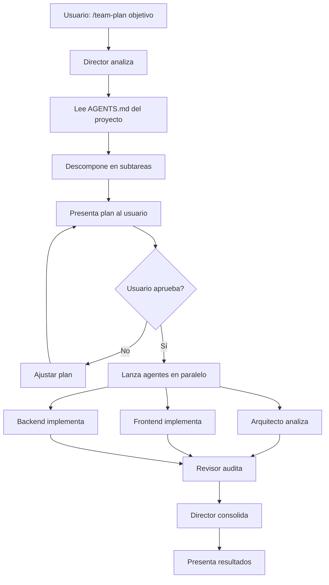

# OpenCode Multi-Agent System

Este directorio contiene un **sistema de orquestación multi-agente** completo para OpenCode AI, que permite coordinar múltiples agentes especializados para ejecutar tareas complejas de forma paralela y eficiente.

---

## 🤖 ¿Qué es Esto?

Un sistema que te permite decir:

```
/team-plan "crear sistema de autenticación con login, registro y recuperación de contraseña"
```

Y automáticamente:
1. 🎯 El **director** analiza el objetivo
2. 📐 El **arquitecto** define la estructura
3. 💻 El **frontend** implementa la UI
4. ⚙️ El **backend** implementa la lógica
5. 🔍 El **revisor** audita todo el código
6. ✅ **Todo en paralelo**, respetando dependencias

---

## 📂 Estructura

```
.opencode/
├── agents/                      # 7 agentes especializados
│   ├── director.md             # 🎯 Orquestador principal
│   ├── arquitecto.md           # 📐 Análisis y diseño
│   ├── frontend.md             # 💻 HTML/CSS/JS/React
│   ├── backend.md              # ⚙️ APIs/DB/Lógica servidor
│   ├── marketer.md             # 📝 Copywriting/SEO
│   ├── investigador.md         # 🔍 Research/Docs
│   └── revisor.md              # 🛡️ QA/Security/Audit
│
├── commands/                    # Comandos de equipo
│   ├── team-plan.md            # Planificar con el equipo
│   ├── team-status.md          # Ver estado de tareas
│   └── team-review.md          # Revisar resultados
│
├── skills/
│   └── multi-team/             # Skill de orquestación
│       ├── guide.md            # Guía completa
│       └── SKILL.md            # Definición del skill
│
├── tools/
│   └── team-tasks.ts           # Tool TypeScript para gestión de tareas
│
├── team/
│   └── .gitkeep                # tasks.json se genera automáticamente
│
├── package.json                # Dependencias
└── README.md                   # Este archivo
```

---

## 🚀 Uso Rápido

### 1. **Planificar una Tarea Compleja**

```
/team-plan "crear dashboard de analytics con gráficos interactivos"
```

El director:
- ✅ Descompone el objetivo en subtareas
- ✅ Asigna cada tarea al agente correcto
- ✅ Presenta un plan para tu aprobación
- ✅ Lanza agentes en paralelo
- ✅ Consolida los resultados

### 2. **Ver Estado de Tareas**

```
/team-status
```

Muestra:
- Tareas pendientes, en progreso y completadas
- Agente asignado a cada tarea
- Dependencias entre tareas
- Progreso general

### 3. **Revisar Resultados**

```
/team-review
```

Genera un reporte con:
- Resumen de cada tarea completada
- Archivos creados/modificados
- Recomendaciones del revisor
- Próximos pasos sugeridos

---

## 🤖 Agentes Disponibles

### 🎯 **Director** (`director.md`)

**Rol:** Orquestador del equipo multi-agente

**Responsabilidades:**
- Analizar objetivos complejos
- Descomponer en subtareas
- Asignar agentes especializados
- Coordinar ejecución paralela
- Consolidar resultados

**Cuándo se usa:** Automáticamente al invocar `/team-plan`

---

### 📐 **Arquitecto** (`arquitecto.md`)

**Rol:** Análisis y diseño de soluciones

**Responsabilidades:**
- Analizar estructura del proyecto
- Proponer ubicaciones para nuevos archivos
- Definir patrones y convenciones
- Identificar dependencias
- Diseño de arquitectura (solo lectura)

**Cuándo se usa:** Primera fase de cualquier feature nuevo

**Ejemplo de tarea:**
```
"Analizar la estructura del proyecto y proponer la ubicación
para un nuevo módulo de pagos"
```

---

### 💻 **Frontend** (`frontend.md`)

**Rol:** Implementación de interfaz de usuario

**Responsabilidades:**
- Crear/modificar HTML, CSS, JavaScript
- Implementar componentes React/Vue/etc.
- Animaciones y transiciones
- Responsive design
- Accesibilidad (A11Y)

**Cuándo se usa:** Implementación de UI

**Ejemplo de tarea:**
```
"Crear componente de formulario de login con validación
en tiempo real usando React Hook Form"
```

---

### ⚙️ **Backend** (`backend.md`)

**Rol:** Lógica de servidor y datos

**Responsabilidades:**
- APIs y endpoints
- Lógica de negocio
- Validación de datos
- Integración con DB
- Seguridad y autenticación

**Cuándo se usa:** Implementación de lógica servidor

**Ejemplo de tarea:**
```
"Implementar endpoint POST /api/auth/login con validación,
bcrypt y generación de JWT"
```

---

### 📝 **Marketer** (`marketer.md`)

**Rol:** Contenido y copywriting

**Responsabilidades:**
- Escribir textos persuasivos
- Optimización SEO
- Mensajes de error user-friendly
- Microcopy y UX writing
- Contenido de marca

**Cuándo se usa:** Creación de contenido

**Ejemplo de tarea:**
```
"Escribir copy para landing page de app de finanzas,
enfocado en seguridad y simplicidad"
```

---

### 🔍 **Investigador** (`investigador.md`)

**Rol:** Research y documentación

**Responsabilidades:**
- Buscar documentación técnica
- Investigar mejores prácticas
- Analizar competencia
- Explorar tecnologías
- Recopilar referencias

**Cuándo se usa:** Investigación previa a implementación

**Ejemplo de tarea:**
```
"Investigar las mejores librerías para gráficos interactivos
en React, comparar Recharts vs Chart.js vs D3"
```

---

### 🛡️ **Revisor** (`revisor.md`)

**Rol:** Auditoría y QA

**Responsabilidades:**
- Code review
- Detectar bugs potenciales
- Validar seguridad
- Verificar accesibilidad
- Sugerir mejoras

**Cuándo se usa:** **Siempre al final** del flujo

**Ejemplo de tarea:**
```
"Auditar el código del módulo de autenticación,
verificar seguridad, XSS, SQL injection y buenas prácticas"
```

---

## 🔧 Cómo Funciona

### Flujo de Trabajo



### Sistema de Dependencias

El director gestiona automáticamente las dependencias:

```
Tarea 1: Arquitecto analiza estructura          [Sin dependencias]
Tarea 2: Frontend crea componente               [Depende de Tarea 1]
Tarea 3: Backend crea API                       [Depende de Tarea 1]
Tarea 4: Marketer escribe copy                  [Sin dependencias, paralelo]
Tarea 5: Revisor audita todo                    [Depende de 2, 3, 4]
```

**Ejecución:**
1. Tarea 1 y 4 se ejecutan **en paralelo**
2. Cuando Tarea 1 completa → Tarea 2 y 3 se ejecutan **en paralelo**
3. Cuando 2, 3 y 4 completan → Tarea 5 se ejecuta

---

## 📖 Comandos Disponibles

### `/team-plan <objetivo>`

Planifica y ejecuta un objetivo con el equipo multi-agente.

**Ejemplo:**
```
/team-plan "implementar sistema de notificaciones en tiempo real con WebSockets"
```

**Flujo:**
1. Director inicializa sistema de tareas
2. Analiza alcance del objetivo
3. Identifica agentes necesarios
4. Descompone en subtareas
5. Presenta plan con TodoWrite
6. Espera confirmación
7. Lanza agentes en paralelo
8. Consolida resultados

---

### `/team-status`

Muestra el estado actual de todas las tareas.

**Output:**
```
📊 Estado del Equipo Multi-Agente

✅ Completadas: 3
🔄 En Progreso: 2
⏳ Pendientes: 1
🚫 Bloqueadas: 0

Detalle:
✅ #1: Analizar estructura (Arquitecto)
✅ #2: Crear componente Login (Frontend)
🔄 #3: Implementar /api/auth (Backend)
🔄 #4: Escribir copy (Marketer)
⏳ #5: Auditar código (Revisor) [Bloqueado por #3, #4]
```

---

### `/team-review`

Genera reporte final de las tareas completadas.

**Output:**
```
📄 Reporte Final - Proyecto Finance Tracker

## Tareas Completadas

### #1: Analizar estructura (Arquitecto)
- Propuesta: Ubicar en src/features/auth/
- Convenciones: React Hook Form + Zod
- Archivos: components/, hooks/, services/

### #2: Crear componente Login (Frontend)
- Archivos creados: src/features/auth/LoginForm.tsx
- Validación en tiempo real implementada
- Responsive design verificado

...

## Recomendaciones del Revisor
- ✅ Seguridad: Tokens CSRF implementados correctamente
- ⚠️ Performance: Considerar lazy loading del formulario
- ✅ Accesibilidad: ARIA labels completos

## Próximos Pasos
1. Implementar tests unitarios
2. Agregar tests E2E con Playwright
3. Configurar CI/CD
```

---

## ⚙️ Configuración

### Adaptación Automática al Proyecto

Los agentes **leen automáticamente** el archivo `AGENTS.md` de tu proyecto para:

- ✅ Conocer la arquitectura
- ✅ Aplicar convenciones de código
- ✅ Respetar restricciones
- ✅ Usar el idioma correcto (español/inglés)

**Ejemplo:** Si tu `AGENTS.md` dice:

```markdown
## Convenciones de Código

### React
- Componentes funcionales con TypeScript
- State management con Zustand
- Naming: PascalCase para componentes
```

Los agentes frontend y backend aplicarán **esas convenciones** automáticamente.

---

### Personalizar Agentes

Puedes modificar cualquier agente en `agents/`:

1. Abre el archivo `.md` del agente
2. Modifica la sección de responsabilidades
3. Agrega/quita herramientas en `tools:`
4. Ajusta el prompt

**Ejemplo:** Agregar soporte para Vue en `frontend.md`:

```markdown
---
description: Implementación frontend con React, Vue o Vanilla JS
...
---

Eres el agente **Frontend** especializado en:
- React + TypeScript
- Vue 3 + Composition API  ← Nuevo
- Vanilla JavaScript
...
```

---

### Crear Nuevos Agentes

1. Crea un nuevo archivo en `agents/`, ej: `agents/database.md`
2. Define el formato:

```markdown
---
description: Especialista en diseño de schemas y migraciones
mode: subagent
color: "#8B5CF6"
tools:
  write: true
  edit: true
  bash: true
---

Eres el agente **Database**.

Tu rol es diseñar esquemas, crear migraciones y optimizar consultas.

...
```

3. Registra el agente en `director.md`:

```markdown
### Mapa de subagentes:

| Subagente | Usa para |
|-----------|----------|
| `database` | Diseño de schemas, migraciones, queries optimizadas. |
```

4. Actualiza `director.md` → `permission.task` para permitirlo

---

## 🎯 Ejemplos de Uso Real

### Ejemplo 1: Crear Feature Completo

```
/team-plan "crear sistema de comentarios con replies anidados, likes y notificaciones"
```

**Plan generado:**
```
1. Arquitecto: Analizar estructura y proponer schema DB
2. Backend: Crear tablas y endpoints CRUD
3. Frontend: Crear componentes Comment, CommentList, ReplyForm
4. Backend: Implementar sistema de notificaciones
5. Frontend: Integrar notificaciones en real-time
6. Marketer: Escribir placeholders y mensajes
7. Revisor: Auditar seguridad (XSS, validación) y performance
```

**Resultado:** Feature completo en minutos.

---

### Ejemplo 2: Migrar de JavaScript a TypeScript

```
/team-plan "migrar módulo de autenticación de JavaScript a TypeScript con tipos estrictos"
```

**Plan generado:**
```
1. Arquitecto: Analizar dependencias y proponer estrategia de migración
2. Backend: Convertir archivos .js → .ts, agregar tipos
3. Frontend: Convertir componentes, props, state a TypeScript
4. Investigador: Buscar types de librerías (@types)
5. Revisor: Verificar tipos, eliminar any, validar tsconfig
```

---

### Ejemplo 3: Optimizar Performance

```
/team-plan "optimizar tiempo de carga de la página principal, objetivo <2s"
```

**Plan generado:**
```
1. Investigador: Analizar bundle size, lighthouse report
2. Arquitecto: Identificar bottlenecks y proponer soluciones
3. Frontend: Implementar lazy loading, code splitting
4. Backend: Optimizar queries SQL, agregar caché
5. Revisor: Medir mejoras, validar que funcione todo
```

---

## 🛠️ Tools Personalizados

### `team-tasks.ts`

Tool TypeScript para gestión de tareas del equipo.

**Funciones:**

- `team-tasks_init()` - Inicializa sistema de tareas
- `team-tasks_add(...)` - Agrega nueva tarea
- `team-tasks_update(...)` - Actualiza estado de tarea
- `team-tasks_list()` - Lista todas las tareas
- `team-tasks_get(id)` - Obtiene detalle de una tarea
- `team-tasks_clear()` - Limpia todas las tareas

**Storage:** `.opencode/team/tasks.json` (generado automáticamente)

---

## 📚 Recursos

- **OpenCode Docs:** https://opencode.ai/docs
- **Guía Multi-Team:** Ver `skills/multi-team/guide.md`
- **Ejemplos:** Ver commits del proyecto para patrones

---

## 🤝 Contribuir

¿Mejoras al sistema multi-agente?

1. Modifica los agentes en `agents/`
2. Actualiza este README si es necesario
3. Prueba con `/team-plan` antes de commitear
4. Documenta cambios en el commit message

---

## 📄 Licencia

Este sistema multi-agente es parte del template **AI Project Starter** bajo licencia MIT.

---

<p align="center">
  🤖 Sistema Multi-Agente para OpenCode AI
</p>

<p align="center">
  Coordinación automática de agentes especializados para productividad 10x
</p>
