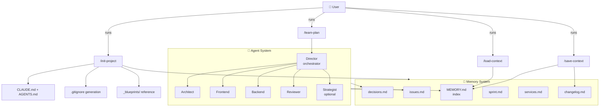
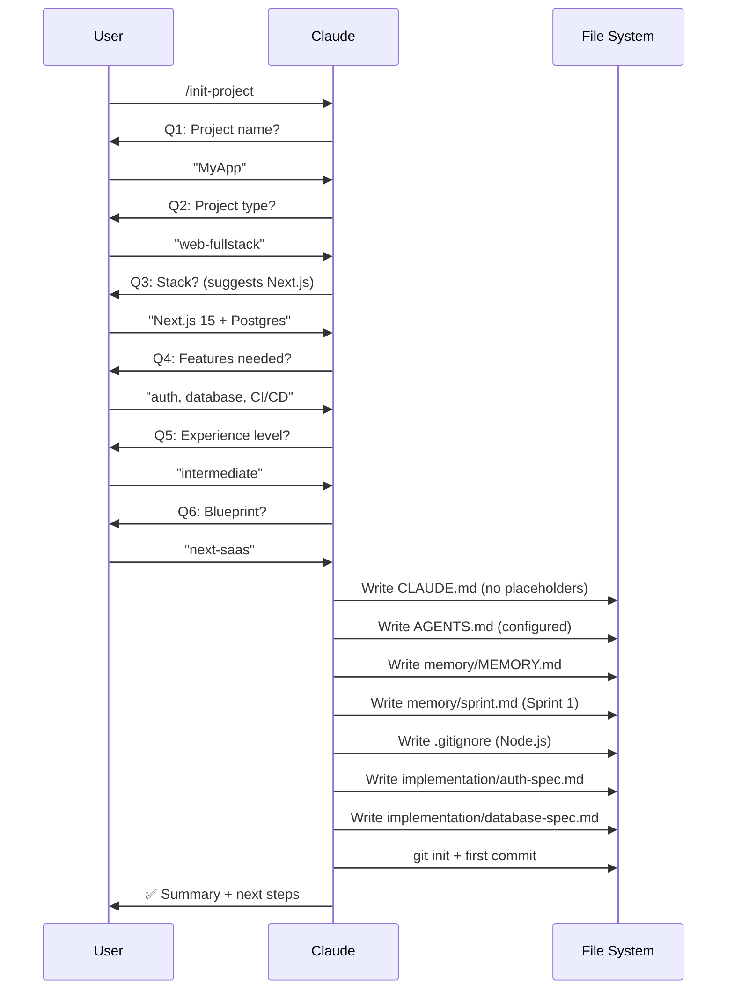
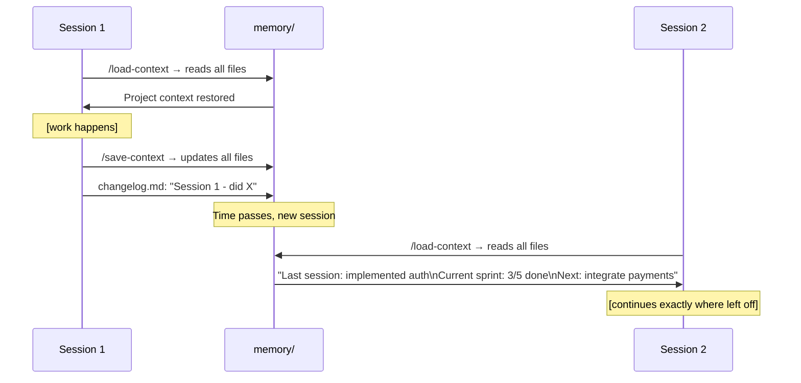

# Architecture

## System Overview



## /init-project Flow



## Memory System Flow



## Directory Structure

```
ai-project-starter/
│
├── .claude/                    AI Config Layer (Claude Code)
│   ├── agents/                 6 specialized agents
│   │   ├── director.md         Orchestrator
│   │   ├── architect.md        System design
│   │   ├── frontend.md         UI/UX
│   │   ├── backend.md          Server/API
│   │   ├── reviewer.md         QA/Security
│   │   └── strategist.md       Research/Content (optional)
│   └── commands/               7 slash commands
│       ├── init-project.md     ← Setup wizard (STAR)
│       ├── load-context.md     Session start
│       ├── save-context.md     Session end
│       ├── validate-setup.md   Verification
│       ├── team-plan.md        Multi-agent planning
│       ├── team-status.md      Task status
│       └── team-review.md      Work review
│
├── .opencode/                  AI Config Layer (OpenCode mirror)
│
├── memory/                     Persistent Context System
│   ├── MEMORY.md               Index (loaded every session)
│   ├── decisions.md            Architecture decisions
│   ├── issues.md               Tech debt tracker
│   ├── sprint.md               Current sprint
│   ├── services.md             External services
│   └── changelog.md            Session history
│
├── _blueprints/                Production Templates
│   ├── next-saas/              Next.js 15 SaaS
│   ├── api-service/            Bun + Hono API
│   └── automation/             Trigger.dev automation
│
├── planning/                   Project planning docs
├── implementation/             Technical specs
├── tests/                      Test files
├── mcps/                       MCP server configs
│
├── CLAUDE.md                   ← Fill this in
├── AGENTS.md                   ← Fill this in
└── START_PROJECT_PROMPT        ← No-CLI fallback
```

## Design Principles

1. **Universal** — Works for any project type, any stack
2. **Lightweight** — No dependencies in the base template
3. **Progressive** — Works without any setup, better with full setup
4. **Persistent** — Memory system prevents context loss
5. **Dual platform** — Claude Code and OpenCode support
